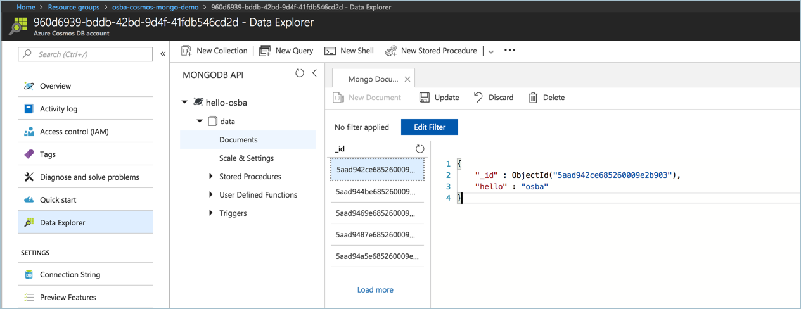

# Open Service Broker for MongoDB on Azure provided by CosmosDB

Simple demo using Open Service Broker for Azure to provision and use MongoDB on Azure provided by CosmosDB. When running this sample, the following takes place:

- Azure resource group and CosmosB / MongodDB instance are created.
- A Kubernetes secret is created with the MongoDB conncton string.
- A pod is started that consumes the secret, runs the [osba-cosmos-mongodb-demo.py](https://github.com/neilpeterson/osba-cosmos-mongodb-demo/blob/master/osba-cosmos-mongodb-demo.py), which creates a database named `hello-osba` and writes a document to the DB every 30 seconds.

# Run the sample

First you need a Kubernetes cluster with the Open Service Broker for Azure installed and configured. See this [documentation](https://docs.microsoft.com/en-us/azure/aks/integrate-azure) for steps on configuring OSBA in an Azure Container Service (AKS) cluster.

Once OSBA is configured, the sample can be deployed with the manifest found in this repo or with a Helm chart (detailed here).

Add the azure-samples chart repository:

```
helm repo add azure-samples https://azure-samples.github.io/helm-charts/
```

Run the chart:

```
helm install azure-samples/osba-cosmos-mongodb-demo
```

## Artifacts

**CosmosDB / MongoDB**:

If you open the Azure portal and browse to the CosmosDB, you should see that a database and collection has been created with the name `hello-osba`.

