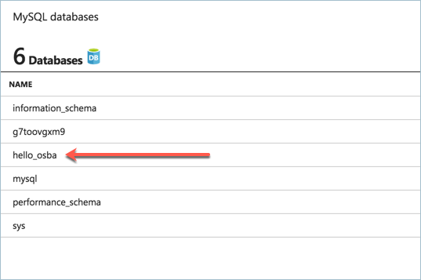

# Open Service Broker for MySQL on Azure

Simple demo using Open Service Broker for Azure to provision and use MySQL on Azure. When running this sample, the following takes place:

- Azure resource group and MySQL instance are created.
- A Kubernetes secret is created with the MySQL connection information.
- A pod is started that consumes the secret, runs the [osba-mysql-demo.py](https://github.com/neilpeterson/osba-mysql-demo/blob/master/osba-mysql-demo.py), which creates a database named `hello_osba`.

# Run the sample

First you need a Kubernetes cluster with the Open Service Broker for Azure installed and configured. See this [documentation](https://docs.microsoft.com/en-us/azure/aks/integrate-azure) for steps on configuring OSBA in an Azure Container Service (AKS) cluster.

Once OSBA is configured, the sample can be deployed with the manifest found in this repo or with a Helm chart (detailed here).

Add the azure-samples chart repository:

```
helm repo add azure-samples https://azure-samples.github.io/helm-charts/
```

Run the chart:

```
helm install azure-samples/osba-mysql-demo
```

## Artifacts

**Database**

If you open the Azure portal, browse to the MySql instance and look at the database, you should see a database named `hello_osba`. This database was created by an application running in a Kubernetes pod.



**Secrets**

The following data is avaliable from the binding secret.

```
Data
====
port:         4 bytes
sslRequired:  4 bytes
tags:         9 bytes
uri:          180 bytes
username:     47 bytes
database:     10 bytes
host:         61 bytes
password:     16 bytes
```